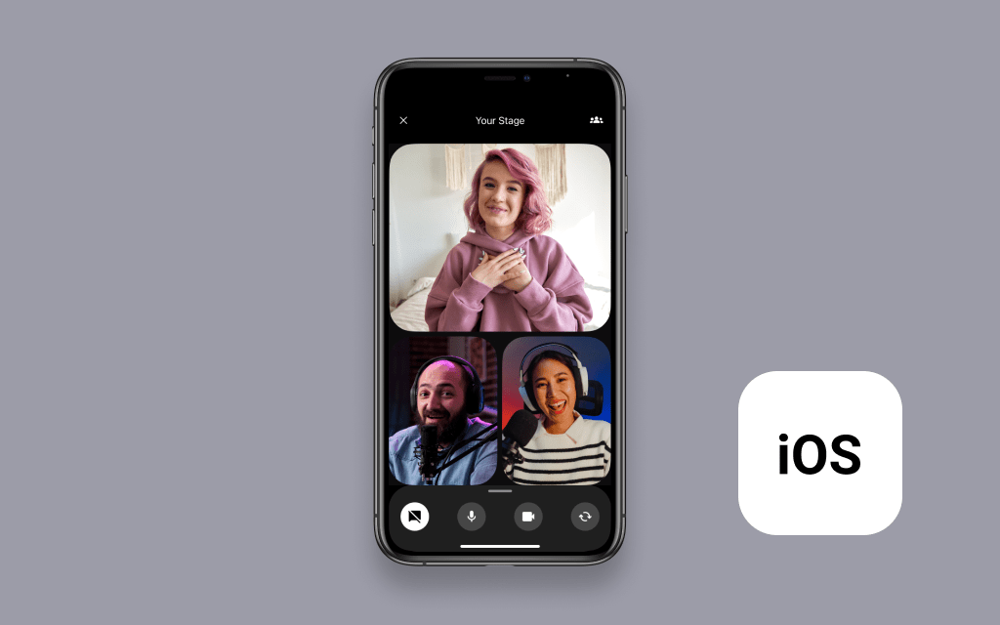

# Amazon IVS Multi-host for iOS Demo

A demo SwiftUI iPhone application intended as an educational tool to demonstrate how you can build a real-time collaborative live streaming experience with [Amazon IVS](https://www.ivs.rocks/).

**This project is intended for education purposes only and not for production usage.**

## Prerequisites

You must have the `ApiUrl` from the [Amazon IVS Multi-host Serverless Demo](https://www.github.com/aws-samples/amazon-ivs-multi-host-serverless-demo).

## Setup

1. Clone the repository to your local machine.
2. Install the SDK dependency using CocoaPods: `pod install`
3. Open `MultiHost-demo.xcworkspace`.
4. Set the `API_URL` constant in the `Constants.swift` file to equal the `ApiUrl` from your deployed [Amazon IVS Multi-host Serverless Demo](https://www.github.com/aws-samples/amazon-ivs-multi-host-serverless-demo).
5. Since iPhone simulators don't currently support the use of cameras or ReplayKit in this app, there are a couple changes you need to make before building and running the app on a physical device.
   1. Have an active Apple Developer account in order to build to physical devices.
   2. Modify the Bundle Identifier for the `MultiHost-demo` target.
   3. Choose a Team for the target.
6. You can now build and run the project on a device.

**IMPORTANT NOTE:** Joining a stage and streaming in the app will create and consume AWS resources, which will cost money.

## Known Issues

- This app has only been tested on devices running iOS 14 or later. While this app may work on devices running older versions of iOS, it has not been tested on them.
- A list of known issues for the Amazon IVS Broadcast SDK is available on the following page: [Amazon IVS Broadcast SDK: iOS Known Issues](https://docs.aws.amazon.com/ivs/latest/userguide/broadcast-ios-issues.html)

## More Documentation

- [Amazon IVS iOS Broadcast SDK Guide](https://docs.aws.amazon.com/ivs/latest/userguide/broadcast-ios.html)
- [Amazon IVS iOS Broadcast SDK Sample code](https://github.com/aws-samples/amazon-ivs-broadcast-ios-sample)
- [More code samples and demos](https://www.ivs.rocks/examples)

## License

This project is licensed under the MIT-0 License. See the LICENSE file.
